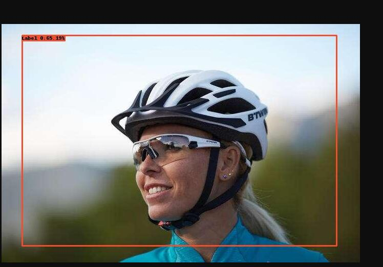

# caffe-ssd
In this project,firstly I make my helmet data set.
Then I change the data set to VOC format.
Next I train my model in caffe.
Finally I test my model in HuaWei Mind Studio.
### Helmet Detection
* Data get
* SSD detection 
| SSD | map |
| --- | --- |
|Helemt detection|65|
Because I run it in my CPU case,just do 1200 iteration,the accuracy is very low.
Such as:

 
